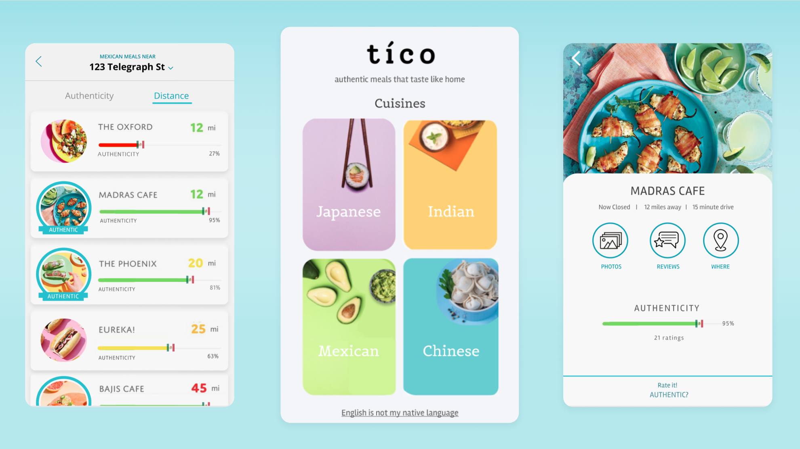

# Tico 

## Table of Contents
- [Project Description](#Project-Description)
- [Teasers](#Teasers)
- [Promotional Video](#Promotional-Video)
- [Contributors](#Contributors)

## Project Description
Many first generation immigrants are always on the lookout for authentic restaurants of their home country’s cuisine, as these provide a special connection back home and an opportunity to find a community in a new country. However, such restaurants are usually poorly rated on popular restaurant search apps, like Yelp, due to cultural and language barriers that impact the service and setting experience. tíco is a restaurant search app that allows users to find authentic restaurants for a cuisine of their choosing. tíco uses sentiment analysis to present Yelp reviews that focus only on authenticity and not other factors, and also provides users with the opportunity to indicate whether a restaurant they visited was an authentic meal.

## Teasers 
 

## Contributors  
- Qitian Liao
- Stephanie Ortiz-Sevilla
- Lucas Brunner
- Tong Jin 
- Itai Smith

